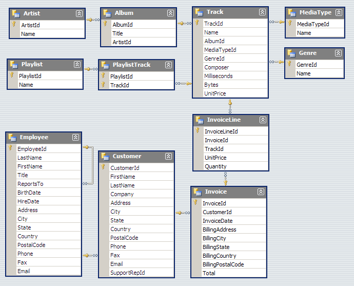

#PRACTICA GUIADA
##ADMINSTRACIÓN DE BASE DE DATOS CON POSGRESQL.

###GIT HUB

1. Crear un usuario en http://www.github.com

2. Ingresar y logearse con su cuenta a Github.

3. Hacer un fork del repositorio: https://github.com/urvog/uasb_DBA

4. Obtener y actualizar el repositorio

5. Revisar la documentación y los datos disponibles para continuar con el trabajo.

###POSTGRESQL

6. Crear un usuario "admin_user" que será el administrador de nuestra base datos.

7. Otorgarle al usuario "admin_user" los permisos para crear una base de datos y crear usuarios

8. Crear la base de datos "musicdb" cuyo propietario es el usuario "admin_user", considerar el tipo de codificación
de la base de datos.

9. Crear tres usuarios:
	- uasb_user		usuario que realiza solo consultas a los datos
	- operator_user		usuario que realiza operaciones sobre las tablas
	- test_user		usuario que realiza solo consultas a vistas de la base de datos

10. Asignar los permisos para que los usuarios creados sólo tengan acceso a la base de datos "musicdb".

11. Crear las tablas de acuerdo al MER proporcionado. Emplear la consola "psql" para realizar este trabajo.

12. Importar los datos a cada tabla de acuerdo a los datos contenidos en la carpeta "RAW CSV" del repositorio de Github.
Utilizar la herramienta de "COPY" en Postgres

13. Crear las siguientes vistas usando lenguaje SQL:
	- Listar el top 5 de las canciones más vendidas por genero
	- Listar los 3 clientes que han comprado más canciones
	- Listar las 20 canciones que tienen mayor duración agrupados por tipo de medio
	- Listar total ventas por mes agrupadas por el vendedor

14. Asignar los permisos necesarios a cada usuario de acuerdo a la descripción en el punto 4.

15. Crear dos backups de la base de datos
	- En formato plano con nombre de archivo "bk_musicdb_usergithub"
	- En formato Postgresl con el nombre de archivo "bk_musicdb_usergithub"

16. Subir ambos archivos backup a su cuenta Github

17. Realizar backups con la opción -a y -v, explicar la diferencia.

18. Obtener un repositorio de un compañero y realizar un fork

19. Crear una nueva base de datos con el nombre "musicdb_test" y recuperar todos los datos con los backups obtenidos
del repositorio de su compañero.

20. Proceder con el commando "vacummdb" para la limpieza la base de datos y toda la información generada guardarla en un
archivo con nombre "vacumm_music.txt".

21. Proceder con el commando "reindexdb" para la reindexación de la base de datos y toda la información generada guardarla 
en un archivo con el nombre "reindex_music.txt".

22. Subir los archivo "vacumm_music.txt" y "reindex_music.txt" al repositorio Github.

23. Crear un script para generar un backup de la base de datos, el script deberá construir el archivo con el
nombre del "archivo + un formato de fecha y hora".

24. Subir el script a Github.

25. Utilizar las herramientas .pgpass/cron para construir backups automatizados (TAREA)
